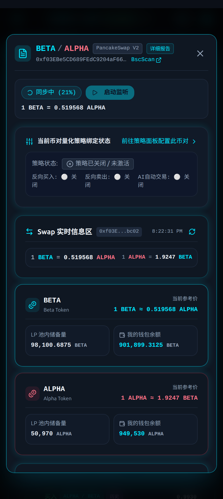
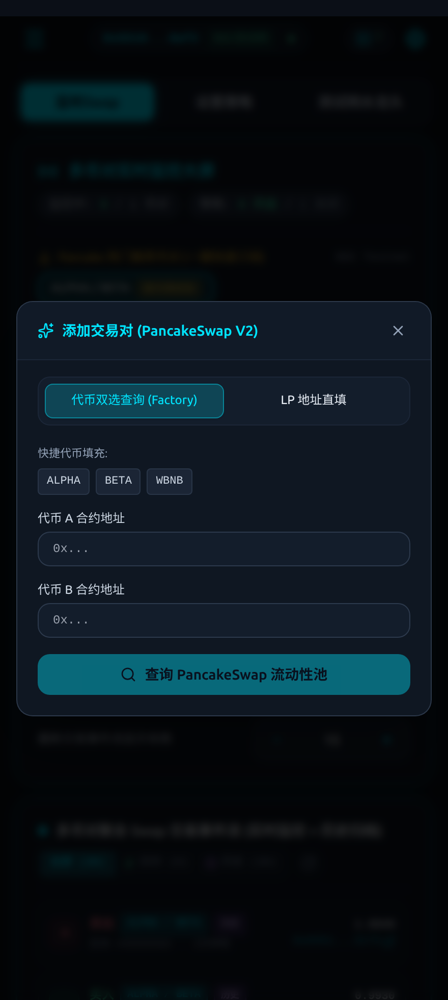
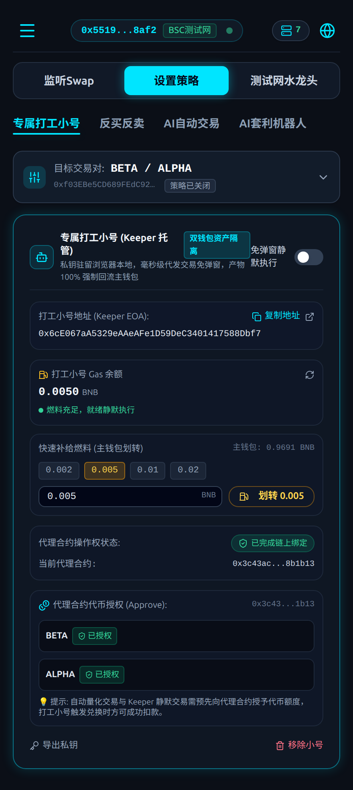
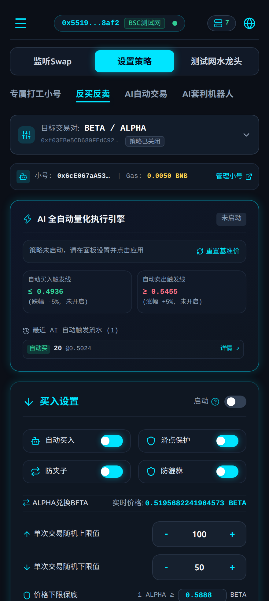
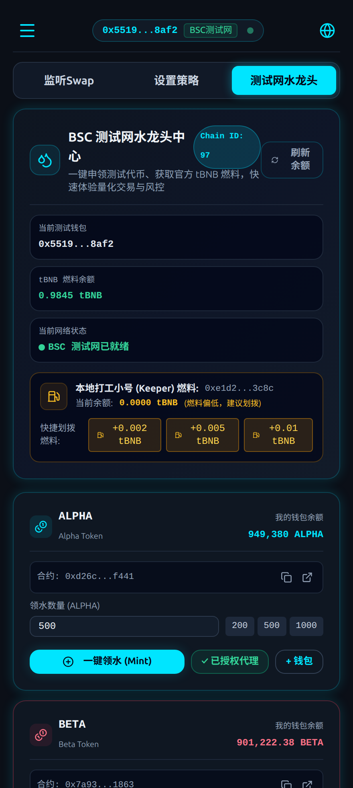
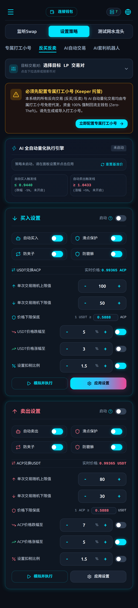

# Uniswap V2 Trader - Web3 自动化量化交易终端

<div align="center">


**专为 Uniswap V2 / PancakeSwap V2 设计的纯客户端、双钱包资产隔离、零弹窗自动量化交易 DApp**

[🌐 生产环境演示体验 (Cloudflare Pages)](https://pk-trader-test.pages.dev) • [📖 架构设计文档](file:///ssd0/git/uniswap-v2-trader/docs/AI/ARCHITECTURE.md) • [🔒 链上安全与合约上下文](file:///ssd0/git/uniswap-v2-trader/docs/AI/CONTRACT_CONTEXT.md) • [🚰 测试网领水指南](file:///ssd0/git/uniswap-v2-trader/docs/BNB_TESTNET_FAUCET_GUIDE.md)

</div>

---

## 📌 项目概述

`uniswap-v2-trader` 是一个运行在浏览器端的纯 Web3 高性能自动化量化交易与币对监听看板。项目基于 PancakeSwap V2 / Uniswap V2 协议构建，深度融合蓝湖暗色科技感（Dark Cyberpunk / Tech H5 Web3）视觉规范。

与传统中心化量化机器人不同：
- **零中心化后端**：彻底摒弃传统 SaaS 的手机注册、账号密码、中心化数据库与托管服务器，100% 逻辑在用户本地浏览器与区块链之间执行。
- **纯 Web3 签名登入**：基于 EIP-191 `personal_sign` 纯客户端免密签名鉴权，不收集任何用户隐私。
- **双钱包资产隔离架构 (Dual-Wallet Asset-Isolated Pattern)**：主钱包保有 100% 本金与提现权，浏览器专属打工小号（Keeper）仅代付 Gas 静默发起交易，兼顾全自动化与资金绝对安全。
- **高性能离线数据底座**：基于 `@evm-event-lake/node-sdk` 与 BSC 归档节点同步 24h 历史深度（28,800+ 区块），结合浏览器原生 `IndexedDB` 极速持久化，提供毫秒级价格走势与买卖冲击分析。

---

## 🖼️ 系统截图与功能模块解析

以下精选实机运行截图均位于项目 [`docs/screenshots/`](file:///ssd0/git/uniswap-v2-trader/docs/screenshots/) 目录下：

### 1. 终端首页与 Web3 签名认证
| 1.1 初始暗色科技界面 (`01_initial_landing.png`) | 1.2 钱包连接与 EIP-191 签名认证 (`02_wallet_authenticated.png`) |
| :---: | :---: |
|  |  |
| 遵循暗色科技风规范，深黑底色（`#0b0f17`）搭配高亮荧光青（`#00e5ff`），提供监听看板与策略配置顶层导航。 | 兼容 MetaMask、OKX、Rabby 等主流 Web3 钱包，通过纯客户端 `personal_sign` 进行免 Gas 会话登录，无中心化账密体系。 |

---

### 2. 实时 Swap 监控大屏与 LP 详细报告
| 2.1 Swap 监控大屏与实时双储备池 (`03_swap_monitor_and_reserves.png`) | 2.2 LP 专属详细报告模态弹窗 (`04_pair_detail_modal_popup.png`) |
| :---: | :---: |
|  |  |
| 单排单个 LP 宽屏大看板，实时展示双边储备量、主钱包代币真实余额、即时买卖双向公允汇率及 24h 深度归档同步进度。 | 点击“详细报告”轻量呼出暗色毛玻璃弹窗，一站式查看该币对的 Pancake 标签、储备深度、发光折线图与专属交易流。 |

| 2.3 24小时价格走势折线图与链上事件流水 (`04_price_trend_and_events.png`) | 2.4 监控大屏新增监听 LP 弹窗 (`13_add_pair_modal_open.png`) |
| :---: | :---: |
|  |  |
| 基于真实链上 `Swap` 历史事件动态渲染高清发光折线图，精确展示高低点、涨跌幅、采样点及买卖方向明细。 | 用户可随时输入或粘贴任意标准 PancakeSwap V2 交易对合约地址，一键加入全局多币对轮询监听池。 |

---

### 3. 专属打工小号 (Keeper) 资产托管中心
| 3.1 专属打工小号独立管理 Tab (`05_keeper_dedicated_tab.png`) | 3.2 策略目标币对下拉搜索器 (`11_pair_dropdown_selector.png`) |
| :---: | :---: |
|  |  |
| 独立一级策略 Tab。支持浏览器本地一键随机生成打工小号、Gas 燃料余额监控、代理合约绑定、代币授权、私钥安全导出与撤销。 | 支持按代币符号、名称或 0x 合约地址模糊搜索，智能识别新 LP，直观展示每个币对的策略启闭状态徽标。 |

---

### 4. 量化策略配置与风控拦截体系
| 4.1 AI 自动买入与防夹设置 (`06_ai_autotrade_runner.png`) | 4.2 AI 自动卖出与扣税配置 (`07_strategy_execution_panel.png`) |
| :---: | :---: |
|  |  |
| 配置价格下跌买入阈值、单次随机买入数量上下限（防追踪防女巫）、滑点保护、防夹（Anti-sandwich）与防貔貅保护。 | 配置价格上涨卖出阈值、扣税代币（Fee-on-Transfer）比例补偿、最低保底价格（Price Floor）与策略持久化生效。 |

| 4.3 静态模拟与价格保底风控拦截 (`08_risk_control_interception.png`) | 4.4 链上真实交易广播与成功确认 (`09_manual_trade_success.png`) |
| :---: | :---: |
|  |  |
| 发起交易前自动进行 Dry-Run 静态模拟调用。当市场真实对价低于 Price Floor 保底时，**立即弹出告警并精准阻断，0 Gas 损耗**。 | 风控通过后，系统通过打工小号免弹窗代发签名，并在区块打包成功后弹出翡翠绿 Toast，附带 BscScan 链上溯源链接。 |

---

### 5. 全自动中控流水与测试网领水辅助
| 5.1 AI 全自动量化执行中控与流水 (`10_autotrade_triggered_history.png`) | 5.2 BSC 测试网水龙头中心与快速上手 (`11_testnet_faucet_center.png`) |
| :---: | :---: |
|  |  |
| 呈现打工小号运行状态、低燃料前置警报、动态浮动触发线以及策略自动触发并执行成功的历史流水明细。 | 内置官方 tBNB 领水导航与已部署的测试币一键 Mint 入口，配套 5 步新手快速上手向导（`12_testnet_fast_track_guide.png`）。 |

| 5.3 线上生产环境部署验证 (`cloudflare-live.png`) |
| :---: |
|  |
| 成功构建并发布至 Cloudflare Pages 全球边缘加速网络，毫秒级冷启动，支持全网随时在线访问。 |

---

## ⚙️ 核心机制：它是如何实现自动交易的？

系统实现真正全自动交易的核心在于**闭环的链上事件监听、多维度策略计算、静态预执行模拟与专属打工小号（Keeper）代发调度**：

```mermaid
flowchart TD
    subgraph Data_Engine [1. 数据捕获与底座]
        RPC[BSC 归档/实时 RPC 节点] --> SDK[EVMEventLake Node SDK]
        SDK --> IDB[(本地 IndexedDB 缓存)]
        SDK --> Poller[3秒实时区块日志轮询器]
    end

    subgraph Strategy_Engine [2. 汇率富化与策略评估]
        Poller --> Enricher[enrichEvent 价格与买卖冲击富化]
        Enricher --> ActivePair[ActivePairContext 实时公允汇率]
        ActivePair --> Evaluator{策略触发器\nReverse / AutoTrade / Growth}
    end

    subgraph Risk_Simulator [3. 静态预执行与风控校验]
        Evaluator -- 满足买卖阈值 --> DryRun[Router.getAmountsOut 静态模拟]
        DryRun --> FloorCheck{价格是否低于\nPrice Floor 下限?}
        FloorCheck -- 是: 异常偏差/滑点过大 --> Reject[终止执行 0 Gas 损耗\n弹出风控拦截告警]
        FloorCheck -- 否: 通过风控 --> Sizing[随机生成交易量 Range(Min, Max)]
    end

    subgraph Silent_Execution [4. 专属打工小号静默代发]
        Sizing --> KeeperSign[打工小号 Keeper 本地离线私钥签名]
        KeeperSign --> ProxyTrader[调用 UniswapV2ProxyTrader.executeSwap]
        ProxyTrader --> Router[PancakeSwap V2 Router 执行兑换]
        Router --> ReturnTokens[产物代币 100% 强制回流主钱包 to=user]
    end

    subgraph Feedback [5. 状态反馈与历史流水]
        ReturnTokens --> Toast[NotificationContext 广播确认气泡]
        ReturnTokens --> HistoryStore[记录至 AI 自动量化触发流水表]
    end
```

### 详细执行步骤拆解：

1. **毫秒级区块链事件监听与数据底座同步**：
   - 依赖 [`@evm-event-lake/node-sdk`](file:///ssd0/git/uniswap-v2-trader/docs/AI/SDK_CONTEXT.md)，连接 BSC Testnet 归档节点（如 `publicnode` / `drpc`）；
   - 首次载入交易对时，在后台自动完成过去 24 小时（约 28,800 区块）的历史 `Sync` 与 `Swap` 事件回溯；
   - 历史事件持久化在浏览器原生 IndexedDB（`indexeddb://uniswap_v2_trader`），大幅降低对 RPC 节点的重复拉取压力；
   - 历史同步完成后，无缝切入 3 秒周期的实时增量区块轮询器，确保盘口动向零滞后。

2. **链上指标与即时买卖公允汇率富化 (Enrichment Engine)**：
   - 借助 `enrichEvent` 回调函数，结合 Multicall3 批量查询双边储备量（`getReserves`）与代币精度；
   - 精确计算每一笔链上大单对价格的冲击幅度（Price Impact），按时序推算当前买卖方向的真实公允成交价。

3. **策略评估与智能触发器 (Strategy Evaluator)**：
   - **反买反卖策略 (Reverse Trading)**：监控大盘动向。当外部大单抛售导致价格跌幅超过设定阈值（如 -5%）时，自动触发逆向买入抄底；当价格被推高超过设定涨幅（如 +5%）时，自动触发逆向卖出止盈。
   - **AI 限价与区间交易 (Auto Limits)**：实时以基准价格为锚点，动态划定买入/卖出触发线。
   - **随机防夹交易量 (Randomized Sizing)**：支持设定单次交易区间的最小与最大值（如 10 ~ 50 Token），由引擎在区间内随机生成下单量，防止链上 MEV 机器人和夹子盯盘。
   - **AI 价格增长模式 (Price Growth)**：按设定的拉盘目标和定投频率分批分时段持续护盘。

4. **静态模拟预执行与全方位风控拦截 (Dry-Run Simulator)**：
   - **在真正广播交易前，系统绝不盲目发链**。
   - 前端调度核心首先调用 Router 的 `getAmountsOut` 开展静态调用模拟：
     - **价格保底拦截 (Price Floor)**：若模拟计算得到的对价低于用户设定的最低保护价，立即终止交易，不浪费 1 毫 Gas。
     - **防貔貅检测 (Anti-Honeypot)**：若目标代币限制卖出或调用发生 Revert，立即拦截并报警。
     - **滑点与扣税补偿 (Fee-on-Transfer)**：自动把代币扣税比例纳入容差计算，保障扣税代币平稳成交。

5. **专属打工小号 (Keeper) 静默免弹窗代发**：
   - 传统 DApp 每次执行都会弹出 MetaMask 窗口让用户点击确认，导致无法实现全自动化。
   - 本系统将交易转交由在浏览器本地生成的**专属打工小号**。Keeper 直接调用合约并在本地签名，几毫秒内将交易通过 RPC 广播上链，实现真正的无人值守静默自动量化！

---

## 🔐 核心安全专题：打工小号 (Keeper) 的安全性设计

在传统量化系统中，用户往往被迫向中心化平台提供主钱包私钥，一旦服务器被黑或平台跑路，本金将瞬间归零。

为此，本项目开创性地设计了**双钱包资产隔离模型 (Dual-Wallet Asset-Isolated Pattern)**，从智能合约数学级底层保证主钱包的**绝对资金安全**：

```
+-----------------------------------------------------------------------------+
|                            用户主钱包 (Master EOA)                           |
|  - 保留 100% 本金资产 (USDT / BNB / ALPHA / BETA)                            |
|  - 拥有专属提现权与合约最高控制权                                              |
|  - 调用 setKeeper(keeperAddress) 授予小号代发资格                            |
|  - 调用 approve(proxyTrader, amount) 授予代币额度                            |
|  - 强制作为每次交易产物的唯一接收者 (to = user)                               |
+-----------------------------------------------------------------------------+
                                     |
                +--------------------+--------------------+
                |                                         |
                v                                         v
+-----------------------------+             +-----------------------------+
|    打工小号 (Keeper EOA)     |             |    UniswapV2ProxyTrader     |
| - 仅存放微量 Gas (0.005 BNB) |             |  - immutable router 锁定    |
| - 浏览器本地私钥免弹窗签名   | ----------> |  - 强校验 keepers[user] 授权|
| - 无任何资金提取/转出权限    | (executeSwap)|  - safeTransferFrom 拉取代币|
+-----------------------------+             |  - 产物 100% 强制回流 user  |
                                            +-----------------------------+
                                                           |
                                                           v
                                            +-----------------------------+
                                            |   DEX Router (PancakeSwap)  |
                                            +-----------------------------+
```

### 1. 为什么打工小号是绝对安全的？

#### ① 资产与权限物理级隔离
- **本金只在主钱包**：主钱包存放所有的本金与主要资金，打工小号账户内**只存放极微量的 Gas 燃料（例如 0.005 ~ 0.01 BNB，仅折合几毛钱人民币）**。
- **低水位安全预警**：系统实时监控打工小号的 Gas 余额。当余额低于 `0.003 BNB` 时自动发出充值告警，即使小号 Gas 耗尽，也绝不会影响主钱包分毫。

#### ② Zero-Theft 公理 (绝对资金归属公理)
- 在核心代理合约 [`UniswapV2ProxyTrader.sol`](file:///ssd0/git/uniswap-v2-trader-contract/contracts/UniswapV2ProxyTrader.sol) 中：
  ```solidity
  // 在兑换时，to 地址强制硬编码为 user (主钱包地址)
  router.swapExactTokensForTokensSupportingFeeOnTransferTokens(
      actualAmountIn,
      amountOutMin,
      path,
      user, // <--- 关键安全公理：产物必须直接打入用户主钱包
      deadline
  );
  ```
- **代币兑换的收款地址 `to` 在合约底层强制写死为 `user`（主钱包地址），不可由 Keeper 动态指定**。
- **Zero-Residual (零留存)**：代理合约自身在交易前后代币余额恒为 0，不沉淀、不暂存任何资产。

#### ③ 不可篡改的 Immutable Router (防钓鱼公理)
- 代理合约绑定的 DEX Router 地址在部署构造函数中直接声明为 `immutable` 常量，部署后任何人（包括部署者或 Keeper）都无法篡改。
- Keeper 无法传入恶意构建的仿冒假 Router 来偷取授权代币。

#### ④ 即便打工小号私钥彻底泄露，黑客也偷不走任何资产！
- **黑客偷走小号私钥能做什么？**
  - 黑客只能调用 `executeSwap` 帮主钱包买卖指定代币，而且**买入的所有代币仍然必须 100% 打入主钱包**！
  - 打工小号在合约中**没有任何提现、转账或将代币发送给第三方的接口权限**。
  - 黑客充其量只能窃取打工小号里剩下的几美分 Gas 零钱，**根本无法触碰主钱包中的任何资产**。

#### ⑤ 随时一键撤销授权 (Instant Revoke)
- 主钱包随时可以在 DApp 界面上点击“解绑 Keeper”，调用合约的 `removeKeeper()` 立即注销该打工小号的代发资格。
- 主钱包可以随时将代币的 `approve` 额度重置为 0。一旦撤权，打工小号立刻丧失一切操作能力。

#### ⑥ 纯客户端本地隔离与防篡改
- 打工小号私钥仅存储在用户浏览器的本地隔离存储中，**绝不会上传到任何云端或后端服务器**。
- 支持私钥一键导出安全备份，并提供格式清洗与内存安全防护。

---

## 🛠️ 技术栈与依赖架构

| 领域 | 核心技术选型 | 作用与优势 |
| :--- | :--- | :--- |
| **前端应用框架** | React 19 + TypeScript + Vite 6 | 前沿响应式渲染、毫秒级构建、极低包体积 |
| **UI 与交互设计** | Tailwind CSS + Lucide Icons | 严格还原蓝湖设计规范、暗色科技风、发光微边框卡片 |
| **EVM 数据底座** | `@evm-event-lake/node-sdk` | 24h 归档深度区块同步、增量事件流、本地 `IndexedDB` 持久化 |
| **只读与聚合调用** | `evm-call` + Multicall3 | 批量聚合代币余额、储备量与汇率查询，高可用多 RPC 故障切换 |
| **Web3 钱包集成** | `viem` + EIP-1193 / EIP-191 | 免 Gas 签名认证、本地私钥安全派生与静默代发交易 |
| **自动化测试** | Vitest + Playwright | 170+ 项单元测试、全流程真实浏览器端到端 E2E 断言 |
| **智能合约体系** | Solidity 0.8.20+ / OpenZeppelin v5 | `UniswapV2ProxyTrader` 代理合约、双钱包隔离、防重入、防扣税代币穿透 |
| **云端部署** | Cloudflare Pages / Workers | 全球边缘 CDN 托管、SPA 重定向路由、秒级静态加速 |

---

## 🚀 本地快速启动与开发指南

### 1. 环境准备
确保您的本地环境已安装：
- **Node.js** `>= 18.0.0`
- **pnpm** `>= 9.0.0`

### 2. 克隆项目与安装依赖
```bash
# 克隆仓库
git clone https://github.com/xzsean666/uniswap-v2-trader.git
cd uniswap-v2-trader

# 安装前端依赖
pnpm install
```

### 3. 启动本地开发服务
```bash
pnpm dev
```
启动后访问控制台打印的地址（默认 `http://localhost:5173`）即可进入 Web3 交易终端。

### 4. 运行全量测试套件
```bash
# 运行 Vitest 单元与集成测试 (34 测试套件, 170+ 测试项)
pnpm test

# 检查 TypeScript 类型
pnpm typecheck

# 执行生产环境打包
pnpm build
```

### 5. 一键本地 Hardhat 节点端到端联调
前端工程内置了与智能合约全自动联调的测试脚本：
```bash
# 自动启动本地 Hardhat 链，自动部署合约，并运行打工小号端到端真实交易测试
pnpm test:local

# 启动本地持久化交互节点 (终端会输出预充值 10000 ETH 的测试私钥供 MetaMask 导入)
pnpm node:local
```

---

## 🌐 BSC 测试网实操快速指南

为了便于零成本体验完整自动化交易闭环，项目已在 **BSC Testnet (Chain ID: 97)** 上部署了完整的 PancakeSwap V2 交易对与代理合约：

| 组件类型 | 合约地址 / 链接 | 详细说明 |
| :--- | :--- | :--- |
| **PancakeSwap V2 Router** | [`0xD99D1c33F9fC3444f8101754aBC46c52416550D1`](https://testnet.bscscan.com/address/0xD99D1c33F9fC3444f8101754aBC46c52416550D1) | 官方测试网路由合约 |
| **UniswapV2ProxyTrader** | [`0x3c43ac2680e9a4fc387a31ea47f9a88eee8b1b13`](https://testnet.bscscan.com/address/0x3c43ac2680e9a4fc387a31ea47f9a88eee8b1b13) | 专用于打工小号静默代发的代理交易合约 |
| **ALPHA 测试代币** | [`0xd26cdc2d33bda34c07f01c459ab32a2bf4c9f441`](https://testnet.bscscan.com/address/0xd26cdc2d33bda34c07f01c459ab32a2bf4c9f441) | 标准 ERC-20 测试币 (18 精度) |
| **BETA 测试代币** | [`0x7a939029997569074973b1ee95118d387f171863`](https://testnet.bscscan.com/address/0x7a939029997569074973b1ee95118d387f171863) | 标准 ERC-20 测试币 (18 精度) |
| **BETA / ALPHA 真实 LP** | [`0xf03EBe5CD689FEdC9204aF66Cb3431750B89bc02`](https://testnet.bscscan.com/address/0xf03EBe5CD689FEdC9204aF66Cb3431750B89bc02) | 拥有 100,000 BETA + 50,000 ALPHA 真实流动性池 |

> [!TIP]
> 📖 想要领取 tBNB 燃料或一键 Mint 测试币？请查阅详细的 [BSC 测试网领水与实操手册](file:///ssd0/git/uniswap-v2-trader/docs/BNB_TESTNET_FAUCET_GUIDE.md)。

---

## 📜 开源协议

本项目采用 [MIT License](file:///ssd0/git/uniswap-v2-trader/LICENSE) 开源协议。
