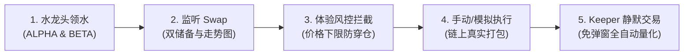

# BNB Smart Chain 测试网 (BSC Testnet) 领水与实机测试指南

本指南详细介绍了 BNB Smart Chain 测试网络（BSC Testnet / Chapel, Chain ID: 97）的环境配置、官方 tBNB 燃料水龙头、已部署的 Mock 测试代币与 LP 交易对信息，以及如何通过 DApp 内置的「测试网水龙头」Tab 交互领取代币并快速完成全量化交易流程测试。

---

## 一、BSC 测试网络基础参数 (Network Parameters)

在开始测试前，请确保您的 Web3 钱包（如 MetaMask、OKX Wallet 等）已添加并切换至 BSC 测试网：

| 参数项 | 配置值 |
| :--- | :--- |
| **网络名称 (Network Name)** | `BNB Smart Chain Testnet` (Chapel) |
| **链 ID (Chain ID)** | `97` (十六进制: `0x61`) |
| **默认 RPC 节点 (RPC URLs)** | `https://bsc-testnet-dataseed.bnbchain.org` `https://bsc-testnet-rpc.publicnode.com` `https://bsc-testnet.drpc.org` |
| **原生货币符号 (Symbol)** | `tBNB` |
| **原生货币精度 (Decimals)** | `18` |
| **区块浏览器 (Block Explorer)** | [https://testnet.bscscan.com](https://testnet.bscscan.com) |

> [!TIP]
> 也可以通过 [Chainlist (Chain ID: 97)](https://chainlist.org/chain/97) 一键添加该测试网络至 MetaMask。

---

## 二、如何获取 tBNB 测试燃料 (Gas Faucet)

在测试网上进行任何链上交互（领取测试币、授权代币、执行兑换交易）都需要支付极少量的 `tBNB` 作为 Gas 费。

### 1. 官方水龙头渠道
- **BNB Chain 官方测试网水龙头**:
  - 访问地址: [https://www.bnbchain.org/en/testnet-faucet](https://www.bnbchain.org/en/testnet-faucet)
  - 规则: 输入钱包地址，通过人机验证后即可领取 0.1 ~ 0.3 tBNB。
- **BNB Chain 官方 Discord 水龙头**:
  - 加入官方 Discord: [https://discord.gg/bnbchain](https://discord.gg/bnbchain)
  - 进入 `#testnet-faucet` 频道；
  - 发送命令: `/faucet <你的钱包地址>`，机器人将自动向地址转入 0.5 tBNB。

### 2. 备用第三方水龙头
- **QuickNode BSC Faucet**: [https://faucet.quicknode.com/binance-smart-chain/bnb-testnet](https://faucet.quicknode.com/binance-smart-chain/bnb-testnet)
- **Triangle Platform Faucet**: [https://faucet.triangleplatform.com/bnb/testnet](https://faucet.triangleplatform.com/bnb/testnet)

---

## 三、已部署的 Mock 测试代币与交易对清单

为了让开发者与用户无需自行部署即可直接测试完整交易流程，我们在 BSC Testnet 上部署了全套标准 ERC-20 测试代币，并在 PancakeSwap V2 上注入了真实的初始流动性：

### 1. Mock 代币合约信息

| 代币名称 | 符号 | 精度 | 合约地址 | BscScan 浏览器 |
| :--- | :---: | :---: | :--- | :--- |
| **Alpha Token** | `ALPHA` | 18 | `0xd26cdc2d33bda34c07f01c459ab32a2bf4c9f441` | [查看 ALPHA 合约](https://testnet.bscscan.com/address/0xd26cdc2d33bda34c07f01c459ab32a2bf4c9f441) |
| **Beta Token** | `BETA` | 18 | `0x7a939029997569074973b1ee95118d387f171863` | [查看 BETA 合约](https://testnet.bscscan.com/address/0x7a939029997569074973b1ee95118d387f171863) |

### 2. DEX 交易对与核心合约信息

| 组件类型 | 合约地址 | 说明 |
| :--- | :--- | :--- |
| **PancakeSwap V2 LP 交易对** | `0xf03EBe5CD689FEdC9204aF66Cb3431750B89bc02` | `BETA / ALPHA` 真实流动性池（50,000 ALPHA + 100,000 BETA） |
| **PancakeSwap V2 Router** | `0xD99D1c33F9fC3444f8101754aBC46c52416550D1` | 标准 PancakeSwap V2 路由合约 |
| **PancakeSwap V2 Factory** | `0x6725F303b657a9451d8BA641348b6761A6CC7a17` | 标准 PancakeSwap V2 工厂合约 |
| **自动化代理合约 (Proxy Trader)** | `0x3c43ac2680e9a4fc387a31ea47f9a88eee8b1b13` | 负责 Keeper 小号免弹窗静默代扣交易与资产强制回流 |

---

## 四、如何 Faucet 领水 Mock 测试代币

已部署的 `MockERC20` 合约公开开放了 `mint(address to, uint256 amount)` 接口，任何人都可以无限制向自己的地址铸造测试代币。

### 方式一：通过 DApp 内置「测试网水龙头」Tab 一键领水（推荐）
我们在应用主导航中专门增加了「**测试网水龙头**」功能页：

1. 打开 DApp 界面，点击顶部导航的「**测试网水龙头**」选项卡；
2. 连接您的 Web3 钱包（如 MetaMask），系统会自动读取并显示您的主钱包地址、tBNB 余额与当前 ALPHA / BETA 代币余额；
3. **领取 ALPHA 代币**：
   - 在 ALPHA 卡片中输入或选择领水数量（如 500 ALPHA）；
   - 点击「**一键领水 (Mint)**」，在钱包插件中确认交易；
   - 打包确认后，代币自动入账，卡片余额自动刷新；
   - 可点击「**+ 钱包**」按钮调用 `wallet_watchAsset`，一键将代币添加到 MetaMask 资产列表。
4. **领取 BETA 代币**：
   - 在 BETA 卡片中输入领水数量（如 1000 BETA），点击「**一键领水 (Mint)**」即可。

### 方式二：直接在 BscScan 区块浏览器上交互领水（备用）
如果不打开前端界面，也可以直接通过 BscScan 浏览器交互：
1. 打开 [ALPHA 合约 Write 页面](https://testnet.bscscan.com/address/0xd26cdc2d33bda34c07f01c459ab32a2bf4c9f441#writeContract)；
2. 点击 **Connect to Web3** 按钮连接钱包；
3. 找到 `mint` 函数：
   - `to`: 填入您自己的钱包地址；
   - `amount`: 填入铸造数量（注意 18 位精度，如 500 代币需填入 `500000000000000000000`）；
4. 点击 **Write** 并在钱包中签名确认。

---

## 五、项目完整功能测试通关指南 (Step-by-Step)

在成功领取 `tBNB`、`ALPHA` 和 `BETA` 代币后，您可以按以下步骤完成对整个自动化量化交易项目的全流程体验：

### 步骤 1：领取代币与授权代理
- 在「测试网水龙头」页面领取 500 ALPHA 和 1000 BETA，确认钱包余额正常显示；
- 可直接在领水卡片内点击「**授权代理 (Approve)**」，向已部署的代理交易合约 (`0x3c43...1b13`) 预授额度。

### 步骤 2：载入并体验 Swap 实时监控
- 点击水龙头页面下方的「**1. 载入并监听 Swap**」快捷按钮，系统自动预填测试对地址并跳转；
- 页面将展现：
  - 双代币 LP 储备量（约 9.9 万 BETA 与 5 万 ALPHA）；
  - 双向实时汇率（1 ALPHA ≈ 1.98 BETA）；
  - 24 小时发光价格走势图与历史成交事件流。

### 步骤 3：体验链上安全与风控拦截机制
- 切换到「**设置策略**」->「**反买反卖**」；
- 在买入配置中，将“价格下限保底”人为设置到高位（例如 `1 ALPHA ≥ 3.50 BETA`）；
- 点击「**模拟并执行**」；
- **预期结果**：系统在交易广播前通过静态模拟调用精准检测到预期输出价格（~1.97）低于下限（3.50），**直接在前端弹窗拦截**：
  > `[X] 模拟预执行拦截: 模拟输出价格 (1.9727) 低于设定的价格下限 (3.5)`
  > 证明防夹子、防穿仓与防貔貅机制生效，未产生链上 Gas 浪费。

### 步骤 4：体验手动真实链上买入
- 将“价格下限保底”调回安全区间（例如 `0.50`）；
- 再次点击「**模拟并执行**」；
- 静态模拟与代币授权全绿通过，钱包弹出交易签名；
- 交易成功广播并在 BSC 测试网确认，界面弹出绿色确认提示，并可点击在 BscScan 查验真实交易记录。

### 步骤 5：体验 Keeper 打工小号免弹窗静默量化交易
- 在「反买反卖」面板顶部，点击「**一键生成本地专属打工小号**」；
- **补给微量 Gas 燃料**：支持 `0.002`、`0.005`、`0.01`、`0.02` BNB 预设或自定义输入（亦可在水龙头中心顶部快捷胶囊一键划转）；
- 点击「**主钱包发起 setKeeper 绑定**」，将小号权限授予代理合约；
- 核验「**代理合约代币授权 (Approve)**」状态（已授权显示绿色盾牌，未授权可一键授权）；
- 开启「**免弹窗静默执行**」开关并启动 AI 自动化交易引擎；
- **预期结果**：后续所有触发策略的 Swap 交易均由打工小号自动完成代发与支付 Gas，**用户主钱包全程无需弹出任何签名窗口**，换取的代币 100% 自动流入主钱包！
