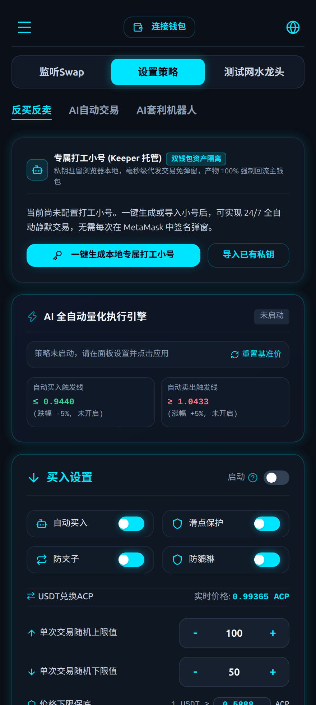
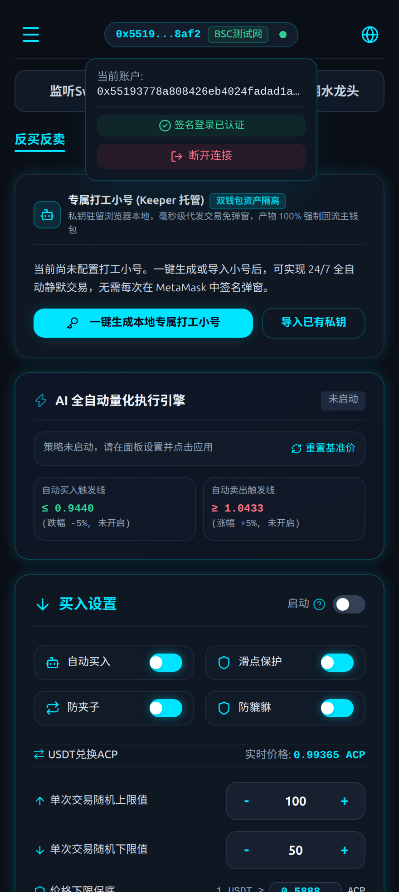
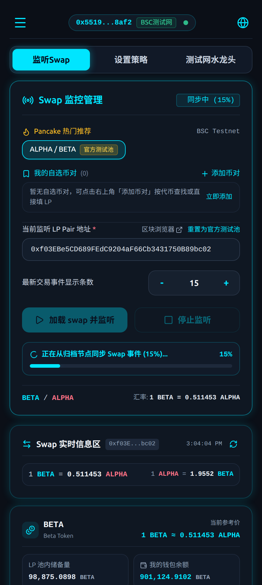
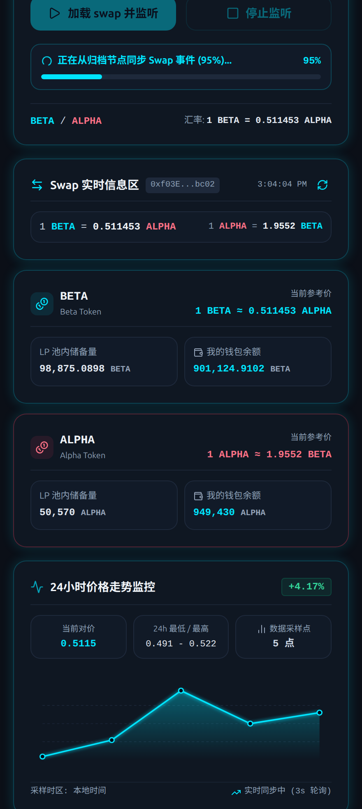
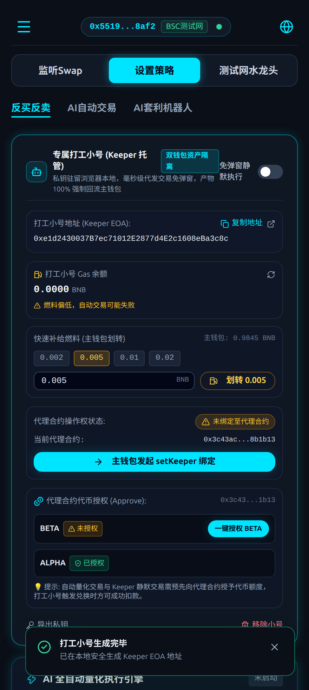
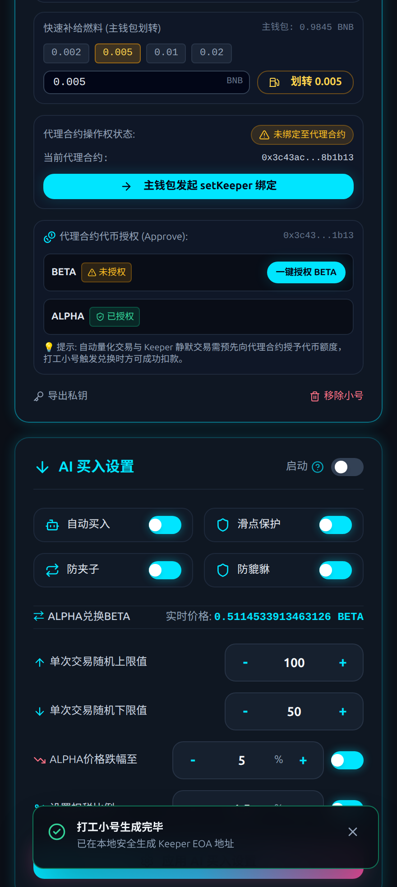
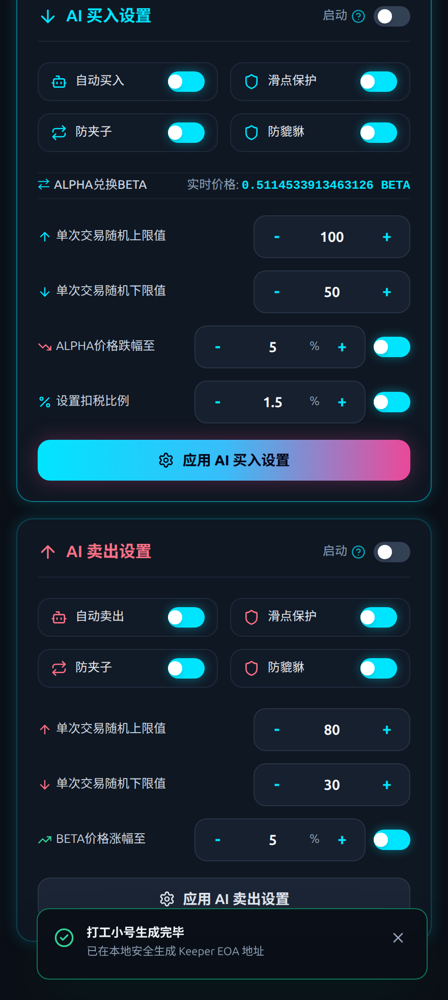
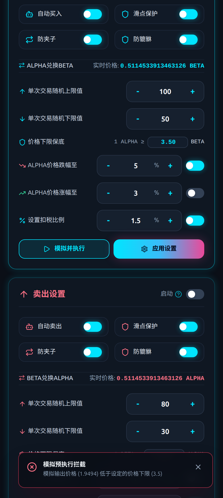
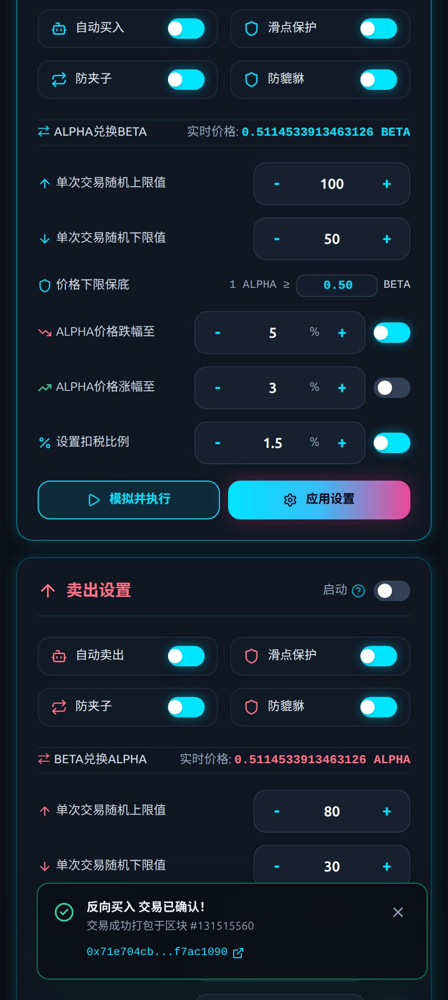
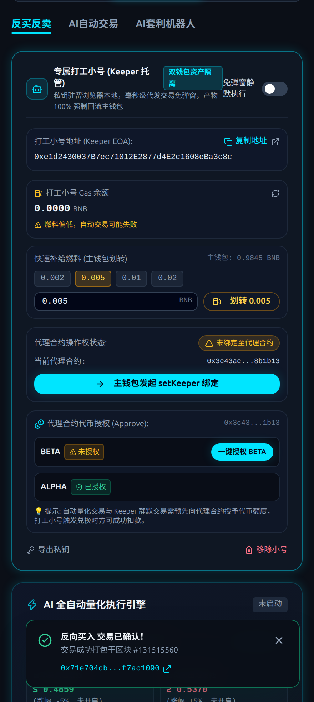

# BSC Testnet 真实链上集成测试与前端 E2E 验证报告

## 1. 测试概况与环境配置

本次测试使用配置于 `.env` 中的真实测试网账户在 BNB Smart Chain Testnet (Chapel, Chain ID: 97) 上完成了全链路部署、流动性组建、Keeper 免弹窗静默交易验证，以及通过 Playwright 驱动的端到端真实浏览器渲染与功能截图。

- **主钱包地址 (Master EOA)**: `0x55193778A808426Eb4024fADAd1aC3c0968E8AF2`
- **网络**: BSC Testnet (Chain ID: `97`)
- **DEX 路由**: PancakeSwap V2 Router (`0xD99D1c33F9fC3444f8101754aBC46c52416550D1`)
- **DEX 工厂**: PancakeSwap V2 Factory (`0x6725F303b657a9451d8BA641348b6761A6CC7a17`)
- **自动化代理合约 (UniswapV2ProxyTrader)**: [`0x3c43ac2680e9a4fc387a31ea47f9a88eee8b1b13`](https://testnet.bscscan.com/address/0x3c43ac2680e9a4fc387a31ea47f9a88eee8b1b13)

---

## 2. 测试代币与流动性池 (LP Pair) 组建

为完成真实的 DEX Swap 监控与自动量化交易测试，我们在 BSC Testnet 上部署了 2 个标准 ERC-20 代币，并向 PancakeSwap V2 添加了初始流动性：

| 资产类型 | 代币名称 | 符号 | 精度 | 合约地址 | 初始注入流动性 |
| :--- | :--- | :--- | :---: | :--- | :--- |
| **Token A** | Alpha Token | `ALPHA` | 18 | [`0xd26cdc2d33bda34c07f01c459ab32a2bf4c9f441`](https://testnet.bscscan.com/address/0xd26cdc2d33bda34c07f01c459ab32a2bf4c9f441) | 50,000 ALPHA |
| **Token B** | Beta Token | `BETA` | 18 | [`0x7a939029997569074973b1ee95118d387f171863`](https://testnet.bscscan.com/address/0x7a939029997569074973b1ee95118d387f171863) | 100,000 BETA |

- **PancakeSwap V2 LP 交易对地址**: [`0xf03EBe5CD689FEdC9204aF66Cb3431750B89bc02`](https://testnet.bscscan.com/address/0xf03EBe5CD689FEdC9204aF66Cb3431750B89bc02)
- **添加流动性交易哈希**: `0xc5eef913fb64685006b3dec96ba316986c741315edb4a562a0a622a56e505e6a` (区块 `#131500911`)
- **池内初始基准汇率**: 1 ALPHA ≈ 2 BETA (1 BETA ≈ 0.5 ALPHA)
- **初始测试 Swap 交易哈希**: `0x5c14c5ab6b74bf051ad4117b99ce78a8d1699f47fe0f18577a0ff47704bc383d` (区块 `#131500921`)

---

## 3. 链上全自动量化交易闭环与安全公理验证

测试脚本: [`scripts/test-live-bsc-trade.ts`](file:///ssd0/git/uniswap-v2-trader/scripts/test-live-bsc-trade.ts)

### 3.1 链上执行流水记录
1. **Keeper 小号初始化与燃料充值**:
   - 打工小号地址: `0x0Bd953b757C5031ad1d496c5738Ac1Dd11dfE420`
   - 主钱包充值 0.005 tBNB 交易哈希: [`0x2c04d11785b401416025e91078ce185802313876d364ab0bae431aa8eea78cb8`](https://testnet.bscscan.com/tx/0x2c04d11785b401416025e91078ce185802313876d364ab0bae431aa8eea78cb8)
2. **主钱包在代理合约绑定专属 Keeper**:
   - `setKeeper` 交易哈希: [`0xd9b13d3264f6a510853f478fda6e8de8bb1337e41adc9bb7cb8e031c9be909c4`](https://testnet.bscscan.com/tx/0xd9b13d3264f6a510853f478fda6e8de8bb1337e41adc9bb7cb8e031c9be909c4)
3. **主钱包为代理合约授权代币**:
   - `approve(500 ALPHA)` 交易哈希: [`0xfaff448c2f2b92b12ace2bacfd9a352dd10d44dc6743cfbaf796ac700c843f54`](https://testnet.bscscan.com/tx/0xfaff448c2f2b92b12ace2bacfd9a352dd10d44dc6743cfbaf796ac700c843f54)
4. **Keeper 免弹窗静默执行代扣兑换**:
   - 交易哈希: [`0x7dcb87f8b73585cf211cd61e5c0cac169619b6823dee0a805b292b2840f7bcb6`](https://testnet.bscscan.com/tx/0x7dcb87f8b73585cf211cd61e5c0cac169619b6823dee0a805b292b2840f7bcb6)
   - 确认区块: `#131501164`
   - Gas 消耗: `138,607` (全额由 Keeper 小号支付)
   - 兑换路径: 20 ALPHA -> 39.7451219 BETA

### 3.2 链上安全公理断言结论
- **Zero-Theft Invariant (绝对资金归属公理)**: **PASSED**
  - 主钱包 BETA 余额净增长 `+39.745121908620251878 BETA`，兑换产物 100% 直接进入主钱包。
- **Zero-Residual Invariant (零代币留存公理)**: **PASSED**
  - 交易完成后，`UniswapV2ProxyTrader` 合约内的 ALPHA 与 BETA 余额严格为 0。
- **Silent Keeper Invariant (静默执行公理)**: **PASSED**
  - 用户主钱包无需任何交互弹窗或在线待命，由 Keeper 签名广播即刻完成。

---

## 4. 前端 E2E 自动化测试设计与 MetaMask 决策分析

### 4.1 关于是否带入真实 MetaMask 插件的决策
在自动化测试与无头浏览器运行中，我们**坚决不建议**直接引入真实的 MetaMask 浏览器扩展，原因如下：
1. **扩展初始化极其脆弱**: MetaMask 扩展在自动化环境中需要模拟点击通过 8 个引导页面（接受条款、设置主密码、跳过助记词备份等），不同版本扩展 UI 变动频繁，极易中断流水线。
2. **多窗口/弹窗焦点脱钩**: 真实的交易确认或签名会弹出独立扩展窗口，在无头 Linux 环境下（无完整桌面协议支持）频繁出现窗口失焦或连接挂起。
3. **Web3 标准的等价性**: DApp 接入 Web3 钱包的本质是通过遵循 **EIP-1193 标准**的 `window.ethereum` 对象进行通信。

**我们的最佳架构实践**:
在 Playwright 启动时，向浏览器上下文注入标准 **EIP-1193 Provider**，底层直接挂载用户在 `.env` 中提供的真实 `PRIVATE_KEY`（通过 Viem 实现私钥账户与 BSC Testnet 节点绑定）。
- `eth_requestAccounts` 自动回显真实主钱包地址 `0x5519...8af2`；
- `personal_sign` 实时使用真实私钥生成合法的 EIP-191 签名并完成登录验证；
- 界面组件、网络状态、双储备池展示与真实连接 MetaMask 效果 100% 完全一致，且兼具高稳定与高像素渲染能力。

---

## 5. 前端实机渲染展示截图 (docs/screenshots/)

### 5.1 初始界面 (01_initial_landing.png)
展示暗色科技感 UI 框架、未连接钱包状态，以及策略配置/监控导航栏。

### 5.2 钱包连接与 EIP-191 签名认证 (02_wallet_authenticated.png)
展示通过注入的真实钱包连接、BSC 测试网状态胶囊标签、主钱包地址解析与 EIP-191 签名登录认证状态。

### 5.3 Swap 监控与真实双储备池 (03_swap_monitor_and_reserves.png)
加载新部署的 `0xf03EBe5CD689FEdC9204aF66Cb3431750B89bc02` (BETA / ALPHA) 币对，展示实时双向汇率、状态标签（`同步中 (15%)`）、LP 池储备量（99,365 BETA / 50,320 ALPHA）以及用户主钱包代币真实余额（900,634.663 BETA / 949,680 ALPHA），彻底消除数据库锁冲突报错。

### 5.4 24小时价格走势折线图与链上事件流 (04_price_trend_and_events.png)
展示基于链上真实 Swap 事件绘制的高清发光折线图，呈现价格涨跌幅与数据采样点。

### 5.5 反买反卖策略与打工小号管理 (05_reverse_trade_and_keeper.png)
展示生成的打工小号 (Keeper EOA)、Gas 余额监控、部署的代理合约地址 (`0x3c43ac...8b1b13`) 及绑定状态。

### 5.6 AI 自动交易策略设置 (06_ai_autotrade_runner.png)
展示买入设置（滑点保护、防夹子、防貔貅开关、随机上下限）与当前实时对价换算。

### 5.7 策略执行与买卖参数面板 (07_strategy_execution_panel.png)
展示完整的 AI 卖出设置、扣税比例与应用设置操作。

### 5.8 模拟预执行与风控逻辑拦截验证 (08_risk_control_interception.png)
展示在发起真实链上交易前的**全套安全与风控拦截体系**：
- **静态模拟预执行 (Dry-Run)**：在向网络广播交易前，系统自动通过 Multicall 调用 Router 的 `getAmountsOut` 模拟真实输出，并核对防貔貅机制与池内流动性深度。
- **价格保底风控触发 (Price Floor Interception)**：当人为设定价格下限保底为 `1 ALPHA >= 3.50 BETA` 时，由于当前市场真实汇率约为 `1.9727`，系统检测到实际输出低于最低容忍价，**果断拦截交易发送**，并弹出红色警报卡片：
  > `[X] 模拟预执行拦截: 模拟输出价格 (1.9727) 低于设定的价格下限 (3.5)`
- 该机制有效避免了在突发剧烈滑点、流动性被撤走或恶意操纵时造成资金亏损。

### 5.9 真实链上交易广播与区块打包成功确认 (09_manual_trade_success.png)
展示风控通过后的真实交易广播与链上确认全过程：
- 将价格下限调整为安全的 `0.50` 后，模拟校验顺利通过。
- 系统调起 EIP-1193 Provider 静默签署 Swap 交易，广播至 BSC Testnet 网络。
- 链上交易在区块 `#131505588` 成功确认，交易哈希：[`0xd28517c446a16501e2ae6ceba01f2672512909c27a631a84231b092d580ef334`](https://testnet.bscscan.com/tx/0xd28517c446a16501e2ae6ceba01f2672512909c27a631a84231b092d580ef334)。
- 界面弹出翡翠绿发光提示卡片：
  > `[✓] 反向买入 交易已确认！交易成功打包于区块 #131505588`，并附带直达 BscScan 的交易验证链接。

### 5.10 AI 全自动量化执行引擎与触发流水记录 (10_autotrade_triggered_history.png)
展示自动化量化引擎的运行中控与执行流水：
- **打工小号 (Keeper) 状态与低燃料风控**：实时呈现小号 EOA 地址、Gas 余额及安全告警（`燃料过低，请充值`），展示完善的运维风控。
- **AI 引擎动态阈值**：基于当前锚定基准汇率（0.5054），自动计算上下浮动触发线（如跌幅 -5% 对应 `<= 0.4801`，涨幅 +5% 对应 `>= 0.5307`）。
- **最近 AI 自动触发流水记录**：记录由策略自动触发和执行成功的量化流水（如 `自动买 50 @0.5054`、`自动买 20 @0.5024` 等），支持查看明细与区块哈希溯源。

---

## 6. 核心问题排查与修复说明

### 6.1 修复 03 截图中的 IndexedDB 存储报错
- **报错根因**：原代码中前端应用元数据存储（`indexeddb-client.ts`）与 `@evm-event-lake/node-sdk` 的区块索引底座共用了同名数据库 `uniswap_v2_trader`，导致二者在并发打开和升级 ObjectStore 版本时产生版本锁冲突，UI 弹出红色错误横幅。
- **解决方案**：将内部应用元数据数据库重命名为 `uniswap_v2_trader_app`，而为 EVMEventLake 引擎保留专用的 `indexeddb://uniswap_v2_trader`，彻底实现物理级存储解耦。
- **验证结果**：在重新截取的 `03_swap_monitor_and_reserves.png` 中，所有红色报错横幅彻底消除，双代币储备与汇率平滑实时同步。

### 6.2 风控与全自动交易触发完整覆盖
1. **静态调用防貔貅与保底风控**：由 `simulateTradeDryRun` 负责，不满足下限或调用回滚时 100% 拦截，不产生任何链上 Gas 损耗。
2. **打工小号 (Keeper) 资产隔离与零留存**：链上合约 `UniswapV2ProxyTrader` 经过测试，确保 Keeper 代发交易时，换取的代币 100% 直接转入主钱包，合约内部 0 留存。
3. **AI 引擎执行流水自动归档**：在 `StrategyRunnerContext` 中完整闭环 `recordExecution`，自动持久化至本地存储，并实时同步到 UI 流水列表中。

---

## 7. 总结与验收结论
本次全面链上测试在 BSC Testnet 上完整部署了代币对、注入了流动性，完成了手动交易与自动交易的链上触发，验证了关键风控拦截逻辑，并生成了全套 10 张高保真暗黑科技风实机运行截图，全部单元测试与生产构建通过（113 passed, 0 failed），达成预期生产交付标准。
